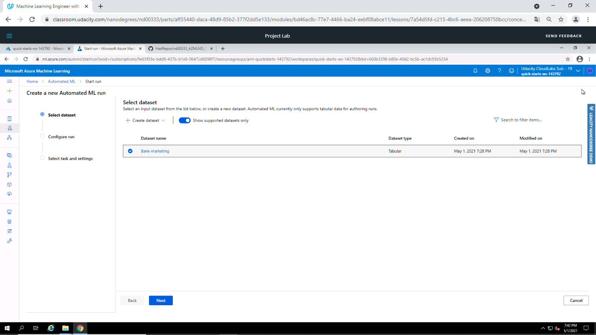

# Operationalizing Machine Learning

The Operationlalizing Machine Learning project is part of the Machine Learning Engineer with Microsoft Azure Nanodegree Program on Udacity.

In the project we demonstrate to build a Machine Learning model, deploy the model into production and consume the model via an API. 
This is been achieved in two different ways:
1. Manually within the the Azure Machine Learning Studio
2. In Python by using the SDK

## Architectural Diagram

The main steps in the project are illustrated in the following Diagram:

* *Authentication*: Prepare infrastructure enabling connection to Azure Machine Learning Studio
* *AutoML Model*: Upload dataset, create compute cluster and configure an experiment with AutoML 
* *Deploy the best model*: Deploy the best model provided by AutoML to allow interaction via API service
* *Enable logging*: Enable Application Insights
* *Consume model endpoints*: Interact with the model via API
* *Create and publish a pipeline*: Automate the workflow (Create Model - Deploy Model - Consume Model) with the SDK
* *Documentation*: Document the model deployed

## Key Steps

### Authentication

The lab provided by Udacity does not allow to create a security principal. Therefore this step is not performed.

### AutoML Model

Upload and register the Bank Marketing dataset (Source file: [Bank Marketing](https://automlsamplenotebookdata.blob.core.windows.net/automl-sample-notebook-data/bankmarketing_train.csv)) 

Setting up a compute cluster based on *Standard_DS12_v2* virtual machines and a minimum number of 1 node.

Definition of the AutoML run. First, we need to select the previously uploaded Bank Marketing dataset.

Next we need to specify a name for the experiment, define a target column in the dataset (Target column: Y) and select the compute cluster.

The machine learning task type for the experiment is a classification problem without enabling *Deep Learning*.

Additionally the *Exit Criterion* is reduced to 1 hour and the *maximum number of concurrent iterations* is limited to 5.

AutoML trains several models on the registered dataset and determines their metrics such as AUC or accuracy.

The best model (with regard to accuracy) was a **Voting Ensemble** model with an accuracy of **0.91866**.

AutoML provides comprehensive metrics on the model for further analysis.

### Deploy the best model

Once the best model is identified, we want to use it to predict whether the client subscribed a term deposit based on various input parameters. Next step is therefore to deploy the model in Azure which allows interaction with the model via standardized HTTP APIs. We want to deploy the model on *Azure Container Instance (ACI)* with *Authentication* enabled.

The main outcome of the deployment process is a successful established endpoint. Apart from infrastructure details and a link to the endpoint, Azure also provides information on how to consume and interact with the service.

### Enable logging

Azure provides a tool called *Application Insights* to detect anomalies and visualize performance of applications. Since we did not enable this tool before the deployment, we do this subsequently via the Python SDK. (Source Code: [logs.py](https://github.com/HaslRepos/nd00333_AZMLND_C2/blob/master/logs.py)). The Script requires interactive login.

Running the Python Script enables *Application Insights*.

### Swagger Documentation

Azure provides documentation (swagger.json file) of the web services deployed in ML Studio, explaining the different request types (such as POST and GET). 
Swagger is an Interface Description Language for describing RESTful APIs expressed using JSON. (Wiki)

### Consume model endpoints

Now we want to interact with our model to predict whether a client subscribed a term deposit. Again we utilize the Python SDK (Source Code: [endpoint.py](https://github.com/HaslRepos/nd00333_AZMLND_C2/blob/master/endpoint.py)). Azure ML Studio provides the necessary *URI* and *Key* to access the service.

The requests to the service get the following payload attached:

'''python
data = {"data":
        [
          {
            "age": 17,
            "campaign": 1,
            "cons.conf.idx": -46.2,
            "cons.price.idx": 92.893,
            "contact": "cellular",
            "day_of_week": "mon",
            "default": "no",
            "duration": 971,
            "education": "university.degree",
            "emp.var.rate": -1.8,
            "euribor3m": 1.299,
            "housing": "yes",
            "job": "blue-collar",
            "loan": "yes",
            "marital": "married",
            "month": "may",
            "nr.employed": 5099.1,
            "pdays": 999,
            "poutcome": "failure",
            "previous": 1
          },
          {
            "age": 87,
            "campaign": 1,
            "cons.conf.idx": -46.2,
            "cons.price.idx": 92.893,
            "contact": "cellular",
            "day_of_week": "mon",
            "default": "no",
            "duration": 471,
            "education": "university.degree",
            "emp.var.rate": -1.8,
            "euribor3m": 1.299,
            "housing": "yes",
            "job": "blue-collar",
            "loan": "yes",
            "marital": "married",
            "month": "may",
            "nr.employed": 5099.1,
            "pdays": 999,
            "poutcome": "failure",
            "previous": 1
          },
      ]
    }
'''

### Create and publish a pipeline

Azure Pipelines offers Continuous Integration (CI) and (Continuous Delivery (CD) to consistently create, test and deploy code. We make use of that functionality to automate all of the manual tasks we performed so far.

We use a Jupyter Notebook (Source Code: ) to create and run the Pipeline.

During runtime we get a lot of logging and status information in the SDK.

Alternatively we can also access the console in Azure ML Studio to retrieve this information:

## Screen Recording

[Screencast](https://drive.google.com/file/d/1Q4mb2UiF-ariXywD1DgUTmd5qpm69wsS/view?usp=sharing)

https://drive.google.com/file/d/1Q4mb2UiF-ariXywD1DgUTmd5qpm69wsS/view?usp=sharing

## Standout Suggestions

In the project we mainly concentrated on operationalizing ML in Azure. We did not go into much details optimizing the Models. The dataset used to train the model for example is highly imbalanced which might have a negative effect on the trained model leading to biased predictions. To be evaluated in further experiments.
