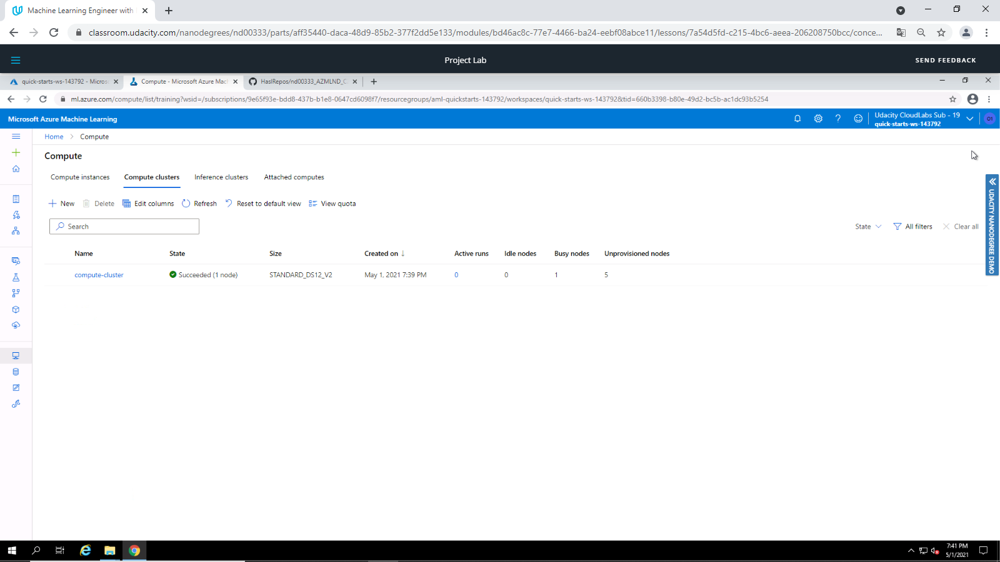
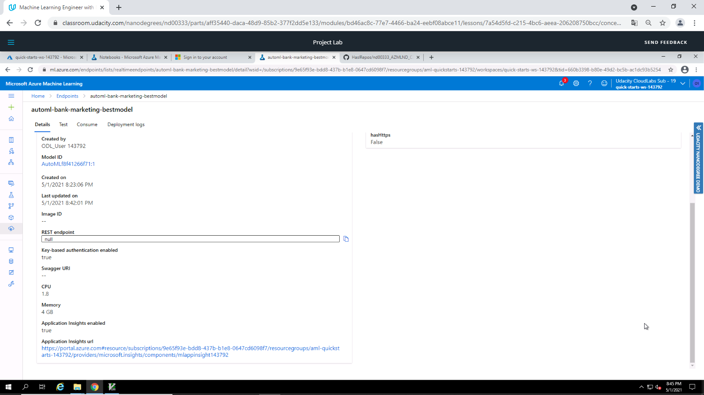

# Operationalizing Machine Learning

The Operationlalizing Machine Learning project is part of the Machine Learning Engineer with Microsoft Azure Nanodegree Program on Udacity.

In the project we demonstrate to build a Machine Learning model, deploy the model into production and consume the model via an API. 
This is been achieved in two different ways:
1. Manually within the the Azure Machine Learning Studio
2. In Python by using the SDK

## Architectural Diagram

The main steps in the project are illustrated in the following Diagram:

* *Authentication*: Prepare infrastructure enabling connection to Azure Machine Learning Studio
* *AutoML Model*: Upload dataset, create compute cluster and configure an experiment with AutoML 
* *Deploy the best model*: Deploy the best model provided by AutoML to allow interaction via API service
* *Enable logging*: Enable Application Insights
* *Consume model endpoints*: Interact with the model via API
* *Create and publish a pipeline*: Automate the workflow (Create Model - Deploy Model - Consume Model) with the SDK
* *Documentation*: Document the model deployed

## Key Steps

### Authentication

The lab provided by Udacity does not allow to create a security principal. Therefore this step is not performed.

### AutoML Model

Upload and register the Bank Marketing dataset (Source file: [Bank Marketing](https://automlsamplenotebookdata.blob.core.windows.net/automl-sample-notebook-data/bankmarketing_train.csv)) 

Setting up a compute cluster based on *Standard_DS12_v2* virtual machines and a minimum number of 1 node.

Definition of the AutoML run. First, we need to select the previously uploaded Bank Marketing dataset.

Next we need to specify a name for the experiment, define a target column in the dataset (Target column: Y) and select the compute cluster.

The machine learning task type for the experiment is a classification problem without enabling *Deep Learning*.

Additionally the *Exit Criterion* is reduced to 1 hour and the *maximum number of concurrent iterations* is limited to 5.

AutoML trains several models on the registered dataset and determines their metrics such as AUC or accuracy.

The best model (with regard to accuracy) was a **Voting Ensemble** model with an accuracy of **0.91866**.

AutoML provides comprehensive metrics on the model for further analysis

### Deploy the best model

### Enable logging

### Consume model endpoints

### Create and publish a pipeline

### Documentation

## Screen Recording
*TODO* Provide a link to a screen recording of the project in action. Remember that the screencast should demonstrate:

## Standout Suggestions
*TODO (Optional):* This is where you can provide information about any standout suggestions that you have attempted.
